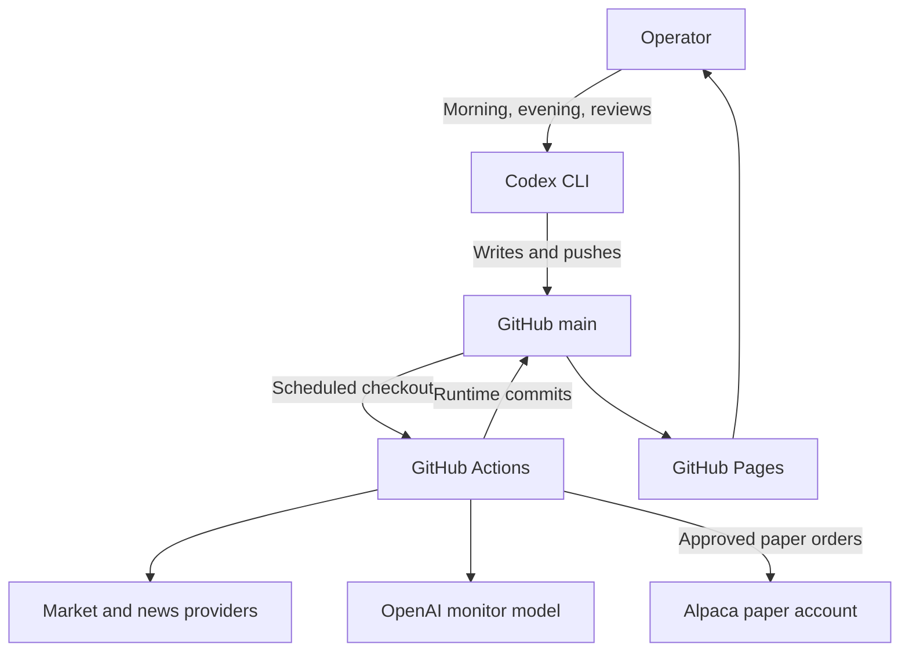
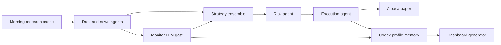
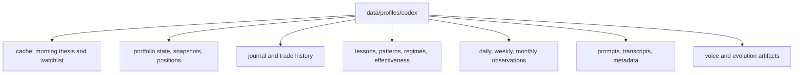
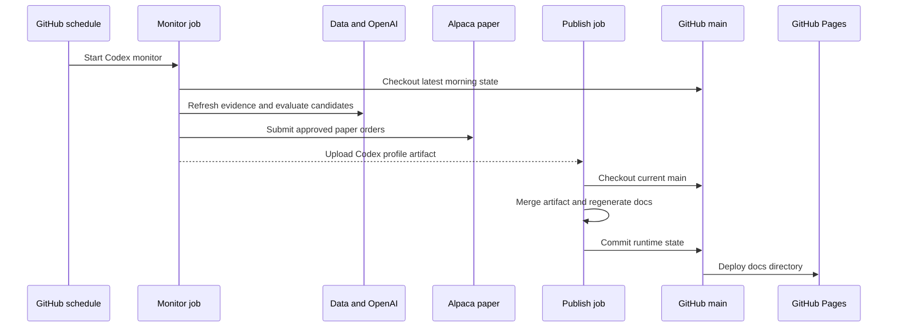
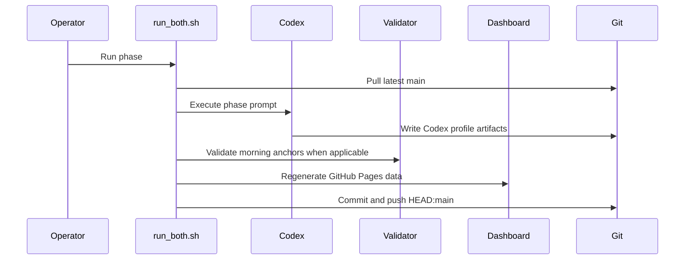

# Architecture

## System Context

## Runtime Components

## Durable State

## Scheduled Workflow

## Local Session Workflow

## Safety Boundaries

- The monitor can execute only after strategy and risk approval.
- `debug` mode never places orders.
- `paper` mode targets Alpaca paper trading only.
- Morning research is preserved separately from intraday monitor outcomes.
- Local morning validation rejects structurally invalid plans and demotes stale entries.
- Publication and Pages deployment are separate jobs, so failures remain visible.

