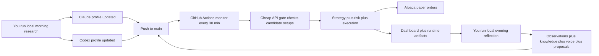
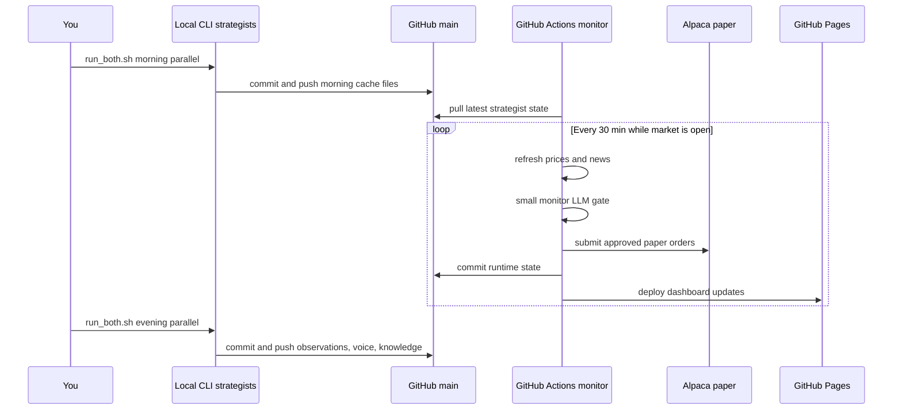

# Agent Trader

Agent Trader is a dual-strategist paper-trading system with a simple operating split:

- Local CLI sessions do the heavy thinking.
- GitHub Actions does lightweight intraday monitoring.
- Alpaca paper accounts receive approved paper orders.
- GitHub Pages shows the latest state, logs, knowledge, voice, and evolution artifacts.

## At A Glance



## Supported Operating Model

### What you run locally

```bash
./scripts/run_both.sh morning parallel
./scripts/run_both.sh evening parallel
./scripts/run_both.sh weekly parallel
./scripts/run_both.sh monthly parallel
./scripts/run_both.sh evolve parallel
```

### What runs automatically

- GitHub Actions `Trading Pipeline`
- Phase: `monitor` only
- Schedule: every 30 minutes during US weekday market hours
- Mode: controlled by GitHub repo variable `MONITOR_RUN_MODE` (`debug` or `paper`)
- Models: cheapest monitor-capable API models

### Why this split exists

- Morning, weekly, and monthly research is much better done with your local CLI subscriptions.
- Intraday monitor only needs a thin layer of judgment, so it can stay cheap.
- Python remains the deterministic execution layer for strategy, risk, orders, journaling, and dashboard output.

## Daily Workflow



## Prompt Surface

| Prompt | Trigger | Purpose | Writes |
|---|---|---|---|
| `morning_research.md` | Local pre-market | Build thesis, watchlist, trade plans, execution conditions | `cache/morning_research.json`, `cache/watchlist.json` |
| monitor prompt in Python | GitHub Actions intraday | Check if live conditions still satisfy the plan | runtime reports, trades, snapshots |
| `evening_reflection.md` | Local after close | Turn the day into observations, lessons, and proposals | daily observations, knowledge updates, proposal backlog |
| `strategist_voice.md` | Local after evening reflection | Give the strategist a short honest operator-facing summary | `voice/latest_voice.json` |
| `weekly_review.md` | Local weekend | Consolidate the week into stronger memory | weekly observations, knowledge updates |
| `monthly_retrospective.md` | Local month-end | Reweight lessons and strategy trust at a month horizon | monthly observations, knowledge updates |
| `evolution_review.md` | Local on demand | Critically review backlog and recommend upgrades | `evolution_review.json`, `EVOLUTION_REPORT.md` |

For the full prompt walkthrough, see [docs/PROMPT_FLOW.md](docs/PROMPT_FLOW.md).

## Paper-Trading Configuration

### Local `.env`

Copy `.env.example` to `.env` and make sure these are set:

```env
RUN_MODE=debug   # use paper before market opens for real paper execution
LLM_PROVIDER=auto
MONITOR_LLM_PROVIDER=openai
MONITOR_MODEL=claude-haiku-4-5-20251001
MONITOR_MODEL_OPENAI=gpt-4o-mini
DATA_DIR=data/profiles/default
AGENT_PROFILE=default
```

Notes:

- `run_both.sh` uses your local `claude` and `codex` CLI tools for research.
- GitHub Actions monitor uses API keys and the repo variable `MONITOR_RUN_MODE`.
- A safe Sunday / dry-run posture is:
  - local `.env`: `RUN_MODE=debug`
  - GitHub repo variable: `MONITOR_RUN_MODE=debug`
- Before a real trading session, flip both to `paper`.
- The standard monitor workflow forces both strategist monitor gates onto OpenAI to keep intraday cost down.
- If you want local Python monitor runs to place paper orders too, your local `.env` also needs valid `ALPACA_API_KEY` and `ALPACA_SECRET_KEY` values.

### Dashboard navigation

- `Session Log` opens the readable `Strategist Interactions` panel inside the dashboard.
- `Evolution` opens the `System Intelligence -> Proposals` panel.
- Raw prompt, transcript, metadata, and evolution artifact files are still linked from inside those cards when you want the source files directly.

### GitHub Secrets

Required for remote monitor:

- `OPENAI_API_KEY`
- `ALPACA_API_KEY_CLAUDE`
- `ALPACA_SECRET_KEY_CLAUDE`
- `ALPACA_API_KEY_CODEX`
- `ALPACA_SECRET_KEY_CODEX`

Optional but useful:

- `MARKETAUX_API_KEY`
- `FRED_API_KEY`
- `FINNHUB_API_KEY`
- `ALPHA_VANTAGE_API_KEY`
- `SEC_EDGAR_USER_AGENT`

## Repository Layout

```text
data/profiles/
  claude/
    cache/
    observations/
    knowledge/
    positions/
    voice/
    interactions/
    IMPROVEMENT_PROPOSALS.md
    improvement_proposals.json
    EVOLUTION_REPORT.md
    evolution_review.json
  codex/
    ...same layout...

docs/
  index.html
  data/
  ARCHITECTURE.md
  KNOWLEDGE_ARCHITECTURE.md
  PROMPT_FLOW.md
```

## Frontend / Dashboard

GitHub Pages is generated from `docs/` and now exposes:

- portfolio and strategist comparison
- market intelligence and trade history
- knowledge summaries
- interaction logs from local CLI sessions
- automated monitor evaluations grouped into the same interaction timeline
- strategist voice summaries
- evolution report links and structured evolution summary

Evolution remains intentionally empty until you run:

```bash
./scripts/run_both.sh evolve parallel
```

Regenerate locally with:

```bash
python -m agent_trader dashboard
```

## Week 1 Runbook

- [WEEK1_PLAN.md](WEEK1_PLAN.md)
- [WEEKBOOK.md](WEEKBOOK.md)

## Validation

```bash
pytest -q
python -m agent_trader validate --data-dir data/profiles/claude
python -m agent_trader validate --data-dir data/profiles/codex
python -m agent_trader dashboard
```

## Core Principle

Use local CLI sessions for the thinking, GitHub Actions for the cheap intraday checks, and `data/profiles/...` as the durable memory of the system.

## More Documentation

- [SYSTEM_GUIDE.md](SYSTEM_GUIDE.md)
- [CURRENT_STATE.md](CURRENT_STATE.md)
- [docs/ARCHITECTURE.md](docs/ARCHITECTURE.md)
- [docs/KNOWLEDGE_ARCHITECTURE.md](docs/KNOWLEDGE_ARCHITECTURE.md)
- [docs/PROMPT_FLOW.md](docs/PROMPT_FLOW.md)
