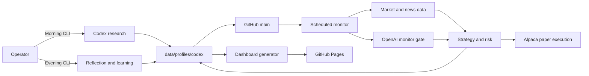

# Agent Trader

Agent Trader is a Codex-driven paper-trading system. Local Codex CLI sessions perform research and reflection; GitHub Actions runs lightweight intraday monitoring; Python enforces strategy, risk, execution, persistence, and dashboard generation.

## Daily Flow


```mermaid
flowchart LR
    O[Operator] -->|Morning CLI| C[Codex research]
    C --> P[data/profiles/codex]
    P --> G[GitHub main]
    G --> A[Scheduled monitor]
    A --> D[Market and news data]
    A --> L[OpenAI monitor gate]
    D --> S[Strategy and risk]
    L --> S
    S --> E[Alpaca paper execution]
    S --> P
    P --> H[Dashboard generator]
    H --> Pages[GitHub Pages]
    O -->|Evening CLI| R[Reflection and learning]
    R --> P
```

## Commands

On Windows PowerShell:

```powershell
& "C:\Program Files\Git\bin\bash.exe" ./scripts/run_both.sh morning parallel
& "C:\Program Files\Git\bin\bash.exe" ./scripts/run_both.sh evening parallel
& "C:\Program Files\Git\bin\bash.exe" ./scripts/run_both.sh weekly parallel
& "C:\Program Files\Git\bin\bash.exe" ./scripts/run_both.sh monthly parallel
& "C:\Program Files\Git\bin\bash.exe" ./scripts/run_both.sh evolve parallel
```

The runner discovers Python through `python` or `uv`, prefers the current Codex desktop CLI, validates morning price anchors, regenerates `docs/`, commits, and pushes `HEAD:main`.

## Automatic Monitoring

The `Trading Pipeline` workflow:

- runs every 30 minutes during the configured weekday market window
- reads `data/profiles/codex/cache/morning_research.json`
- uses OpenAI for the small monitor decision gate
- defaults to `paper` when `MONITOR_RUN_MODE` is unset
- submits only approved paper orders to Alpaca
- commits updated Codex state and deploys `docs/` to GitHub Pages

Required GitHub secrets are `OPENAI_API_KEY` and either the Codex-specific or fallback Alpaca key pair. Market-data keys are optional but improve evidence quality.

## Repository Layout

```text
data/profiles/codex/   Durable strategy, portfolio, knowledge, and interaction state
src/agent_trader/      Deterministic Python runtime
scripts/prompts/       Local phase instructions
scripts/run_both.sh    Local orchestrator
.github/workflows/     Scheduled monitor and Pages deployment
docs/                  Generated GitHub Pages site and published artifacts
tests/                 Unit tests
```

## Validation

```powershell
$env:UV_CACHE_DIR="$PWD\.tmp\uv-cache"
uv run --extra dev python -m pytest -q
uv run --extra dev python -m agent_trader validate --data-dir data/profiles/codex
uv run --extra dev python -m agent_trader dashboard
```

## Documentation

- [Architecture](ARCHITECTURE.md)
- [Current state](CURRENT_STATE.md)
- [Operator weekbook](WEEKBOOK.md)
- [System guide](SYSTEM_GUIDE.md)
- [Coding assistant handoff](CODING_ASSISTANT.md)
- [Prompt flow](docs/PROMPT_FLOW.md)
- [Knowledge architecture](docs/KNOWLEDGE_ARCHITECTURE.md)

