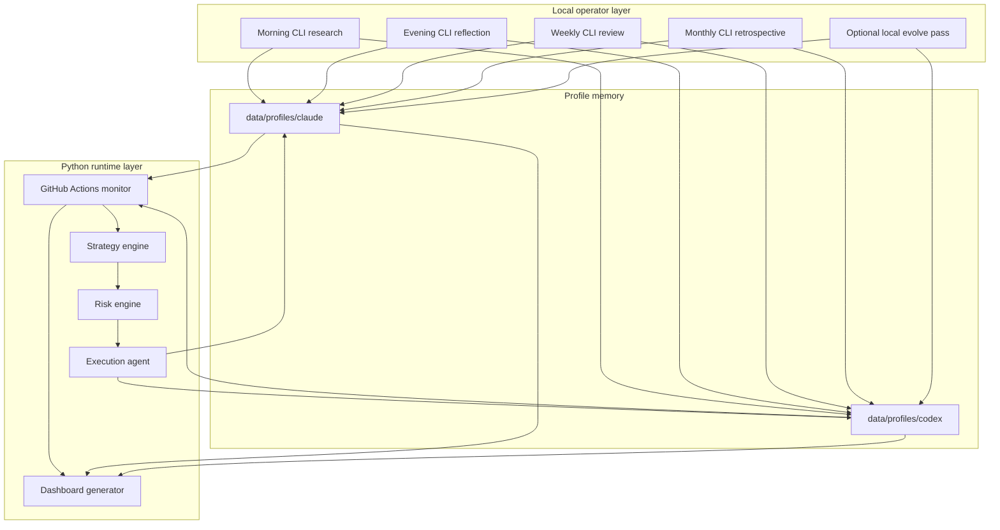
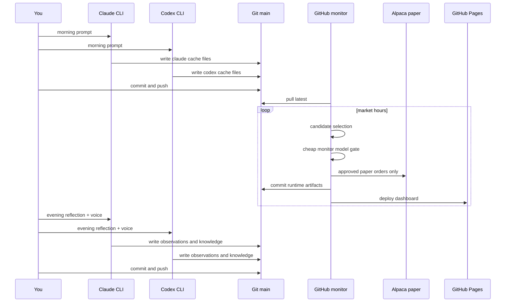

# System Guide

This guide explains exactly how Agent Trader works in its current operating model.

## One-Sentence Mental Model

Use local CLI sessions for the thinking, GitHub Actions for the cheap intraday checks, and `data/profiles/...` as the durable memory of the system.

## The Two Layers



## What Is Manual vs Automatic

### Manual

You run these locally:

```bash
./scripts/run_both.sh morning parallel
./scripts/run_both.sh evening parallel
./scripts/run_both.sh weekly parallel
./scripts/run_both.sh monthly parallel
./scripts/run_both.sh evolve parallel
```

### Automatic

GitHub Actions runs:

- `Trading Pipeline`
- phase: `monitor`
- schedule: every 30 minutes on market weekdays
- run mode: controlled by repo variable `MONITOR_RUN_MODE`

## Sequential Flow



## What Each Prompt Does

### Morning

File: `scripts/prompts/morning_research.md`

Purpose:
- research the current market deeply
- create the daily thesis
- define execution conditions in natural language
- write the cache files monitor will rely on

Writes:
- `cache/morning_research.json`
- `cache/watchlist.json`
- interaction prompt and transcript archives

### Monitor

Implementation: Python prompt inside `ResearchAgent`

Purpose:
- not to redo research
- only to judge whether a setup still fits live data and headlines
- only on a small candidate set

Outputs feed:
- strategy voting
- risk approval
- paper execution

### Evening

File: `scripts/prompts/evening_reflection.md`

Purpose:
- compare morning plan vs market reality
- capture daily observations
- update lessons, patterns, and strategy effectiveness
- extend the improvement backlog

Writes:
- daily observation
- knowledge updates
- `IMPROVEMENT_PROPOSALS.md`
- `improvement_proposals.json`

### Voice

File: `scripts/prompts/strategist_voice.md`

Purpose:
- give the strategist a short honest voice
- summarize what changed, what is weak, and what it needs

Writes:
- `voice/voice_YYYY-MM-DD.json`
- `voice/latest_voice.json`

### Weekly

File: `scripts/prompts/weekly_review.md`

Purpose:
- consolidate noisy daily lessons into stronger weekly memory
- update knowledge with broader evidence

### Monthly

File: `scripts/prompts/monthly_retrospective.md`

Purpose:
- prune weak lessons
- reweight strategy trust
- set a next-month posture

### Evolve

File: `scripts/prompts/evolution_review.md`

Purpose:
- critically review the existing improvement backlog
- separate real high-leverage changes from noise or frustration
- recommend what to implement now vs defer

Writes:
- `evolution_review.json`
- `EVOLUTION_REPORT.md`

## Where The Intelligence Lives

### Local CLI intelligence

This is where the system does rich open-ended thinking:

- morning research
- evening reflection
- weekly review
- monthly retrospective
- optional evolution pass

### API intelligence

This is intentionally small and cheap:

- monitor-time trade approval gate only

Current default monitor posture:

- provider for both strategist monitor jobs: `openai`
- monitor model for both strategist monitor jobs: `gpt-4o-mini`

## What The Python Runtime Still Owns

The LLM does not place orders directly.

Python still owns:

- candidate selection
- strategy votes
- risk validation
- order submission
- portfolio state
- journaling
- dashboard generation

That separation is important because it keeps intraday behavior cheaper and more controllable.

## What The Dashboard Shows

GitHub Pages now exposes:

- strategist comparison
- portfolio history
- daily decisions and trades
- market intelligence
- knowledge summaries
- prompt and transcript archives from local runs
- strategist voice summaries
- evolution summary and report links

## Timing Guidance

### Morning

Best window: `8:15 AM to 8:45 AM ET`

Reason:
- gives the research enough time to finish
- ensures the first `9:30 AM ET` monitor has current profile state

### Evening

Best window: `4:20 PM to 5:00 PM ET`

Reason:
- allows the `4:00 PM ET` monitor run to finish and push
- gives the strategist the full day context

### Weekly

Best window: Sunday evening

### Monthly

Best window: month-end evening or the following weekend

### Evolve

Best use: on demand after a few evenings or after a weekly review

Do not run it because you feel impatient. Run it when you want a sober review of what should actually change.

## Configuration That Matters

### Local `.env`

Important runtime keys:

- `RUN_MODE=debug` for safe dry runs, `RUN_MODE=paper` before a real paper-trading session
- `LLM_PROVIDER=auto`
- `MONITOR_LLM_PROVIDER=openai`
- `MONITOR_MODEL=claude-haiku-4-5-20251001`
- `MONITOR_MODEL_OPENAI=gpt-4o-mini`
- `DATA_DIR=data/profiles/default`
- `AGENT_PROFILE=default`

For the remote monitor workflow:

- set GitHub repo variable `MONITOR_RUN_MODE=debug` for dry runs
- set GitHub repo variable `MONITOR_RUN_MODE=paper` before market-open paper execution

### GitHub secrets

Required for remote monitor:

- OpenAI key
- per-strategist Alpaca paper keys

Anthropic API keys are no longer used by the normal GitHub monitor workflow.

### What is no longer part of the design

These old controls are no longer supported in the streamlined workflow:

- `PRODUCTION_MODE`
- `DEBUG_MODE`
- `DRY_RUN`
- `USE_CLI_AGENT`
- `USE_CLI_AGENT_FOR_MONITOR`
- `CLI_AGENT_PROVIDER`
- `CLI_AGENT_MAX_TURNS`
- `CLI_AGENT_TIMEOUT`

## Practical Operator Rule

If you are unsure what to do next, use this default loop:

1. run `morning`
2. let Actions handle `monitor`
3. run `evening`
4. run `weekly` on the weekend
5. run `evolve` only when you want a deliberate improvement review

## Related Docs

- [README.md](README.md)
- [CURRENT_STATE.md](CURRENT_STATE.md)
- [docs/ARCHITECTURE.md](docs/ARCHITECTURE.md)
- [docs/KNOWLEDGE_ARCHITECTURE.md](docs/KNOWLEDGE_ARCHITECTURE.md)
- [docs/PROMPT_FLOW.md](docs/PROMPT_FLOW.md)
