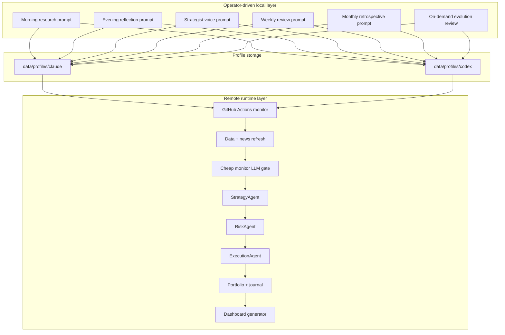
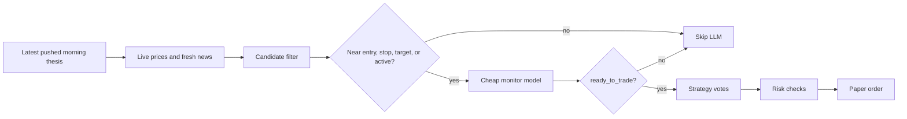
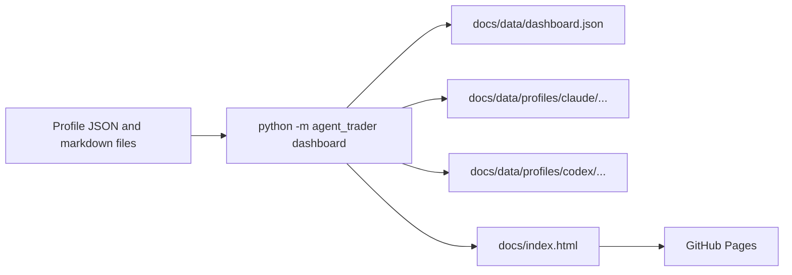

# Architecture

This document is the technical view of the current streamlined system.

## Layered Design



## Monitor Decision Path



## What Belongs To Which Layer

### Local prompt layer

Owns:
- thesis generation
- operator-facing reflection
- knowledge shaping through prompts
- voice summaries
- evolution reviews

### Python runtime layer

Owns:
- data and news refresh
- candidate narrowing
- strategy logic
- risk logic
- paper execution
- portfolio state
- dashboard generation

## Profile-First Storage

```text
data/profiles/<profile>/
  cache/
  observations/
  knowledge/
  positions/
  voice/
  interactions/
  IMPROVEMENT_PROPOSALS.md
  improvement_proposals.json
  EVOLUTION_REPORT.md
  evolution_review.json
```

The source of truth is profile-first. Top-level legacy `data/...` paths are not part of the supported workflow anymore.

## Dashboard Artifact Flow



Dashboard navigation behavior:

- `Session Log` focuses the `Strategist Interactions` panel
- `Evolution` focuses the proposals/evolution panel
- raw artifacts remain available from links inside those panels

## Why This Architecture Is Stable

- heavy research is kept off the remote scheduler
- remote monitor calls are bounded and cheap
- trading decisions still go through deterministic strategy and risk code
- all durable memory is file-based and inspectable
- operator prompts are archived in interaction logs

## Where Evolution Fits

Evolution is intentionally separate from daily trading.

It reads:
- improvement backlog
- observations
- knowledge
- voice summaries
- portfolio and snapshot history

It writes:
- `evolution_review.json`
- `EVOLUTION_REPORT.md`

That keeps self-improvement deliberate instead of letting the system rewrite itself intraday.

If those files do not exist yet, the dashboard should show an empty evolution state rather than an error.
