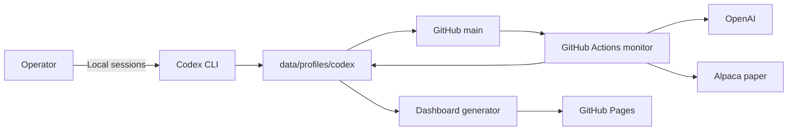

# Architecture

The canonical architecture reference is [`ARCHITECTURE.md`](../ARCHITECTURE.md) at the repository root.

## Published System View

```mermaid
flowchart LR
    Operator -->|Local sessions| Codex[Codex CLI]
    Codex --> Profile[data/profiles/codex]
    Profile --> Main[GitHub main]
    Main --> Monitor[GitHub Actions monitor]
    Monitor --> OpenAI
    Monitor --> Alpaca[Alpaca paper]
    Monitor --> Profile
    Profile --> Dashboard[Dashboard generator]
    Dashboard --> Pages[GitHub Pages]
```

The active system has one profile, `codex`. Morning research is local, intraday monitoring is remote, execution is constrained by deterministic strategy and risk code, and all published state is generated from the durable profile.

