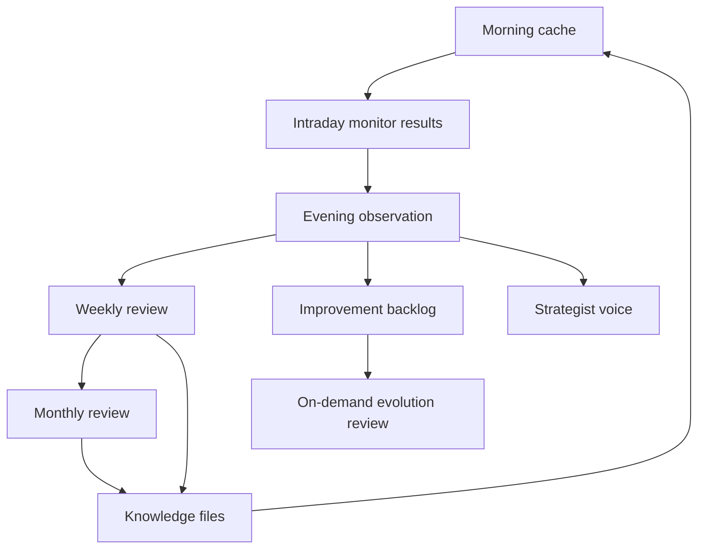
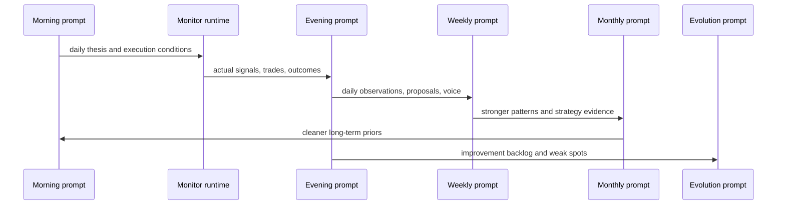

# Knowledge Architecture

This document explains how Agent Trader turns daily activity into durable memory.

## The Memory Stack

## Memory Layers

### 1. Daily cache

Purpose:
- the current-day working thesis

Files:
- `cache/morning_research.json`
- `cache/watchlist.json`

Used by:
- intraday monitor
- evening reflection

### 2. Observations

Purpose:
- capture what actually happened
- create dated evidence before knowledge is generalized

Files:
- `observations/daily/obs_YYYY-MM-DD.json`
- `observations/weekly/week_YYYY-MM-DD.json`
- `observations/monthly/month_YYYY-MM.json`

### 3. Knowledge

Purpose:
- reusable memory that future prompts can trust more than one-off anecdotes

Files:
- `knowledge/lessons_learned.json`
- `knowledge/patterns_library.json`
- `knowledge/strategy_effectiveness.json`
- `knowledge/regime_library.json`

### 4. Self-improvement memory

Purpose:
- capture ideas about how the system itself should improve

Files:
- `IMPROVEMENT_PROPOSALS.md`
- `improvement_proposals.json`
- `voice/latest_voice.json`
- `evolution_review.json`
- `EVOLUTION_REPORT.md`

## How Knowledge Gets Better Over Time

## What Each Knowledge File Should Mean

### `lessons_learned.json`

- concise actionable guidance
- should change behavior
- can contain both timeless rules and current-regime rules

### `patterns_library.json`

- named setups the strategist believes it has seen repeatedly
- should only become trusted after repeated evidence

### `strategy_effectiveness.json`

- summary of which strategy families are working in which regimes
- should influence future weighting, not override judgment blindly

### `regime_library.json`

- practical description of what risk-on, neutral, and risk-off mean for this system
- should be grounded in real recent examples

## What Voice Adds

Voice is not the same as knowledge.

Voice is:
- short-horizon
- candid
- operator-facing
- about current process health

Knowledge is:
- slower moving
- reusable
- more abstract
- intended to feed future prompts

## What Evolution Adds

Evolution is not another daily reflection.

It is a backlog review that asks:
- which changes are supported by real evidence?
- which proposed changes are still noise?
- what should be implemented now versus deferred?

That makes it the bridge between observation and actual system change.

## Rule Of Thumb

Use this trust ladder:

1. one day = anecdote
2. several evenings = emerging theme
3. weekly review = candidate memory
4. monthly review = durable memory
5. evolution review = change recommendation
