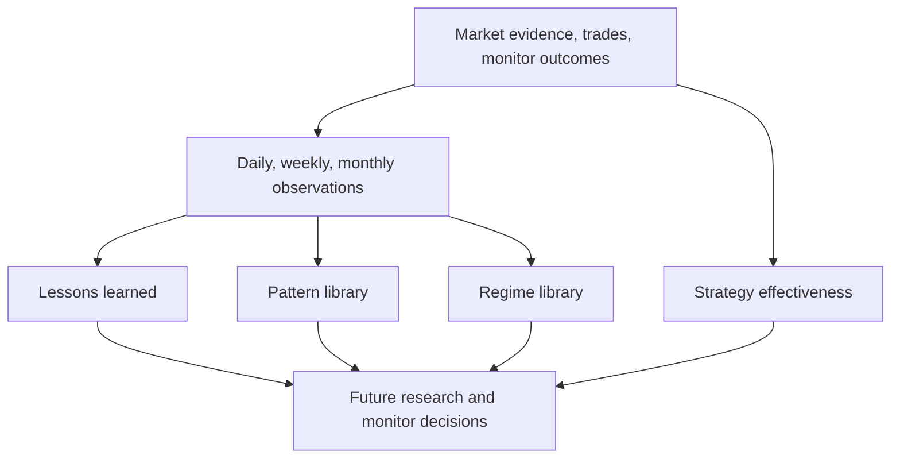

# Knowledge Architecture

## Memory Layers

```mermaid
flowchart TB
    Evidence[Market evidence, trades, monitor outcomes]
    Observations[Daily, weekly, monthly observations]
    Lessons[Lessons learned]
    Patterns[Pattern library]
    Regimes[Regime library]
    Effectiveness[Strategy effectiveness]
    Decisions[Future research and monitor decisions]

    Evidence --> Observations
    Observations --> Lessons
    Observations --> Patterns
    Observations --> Regimes
    Evidence --> Effectiveness
    Lessons --> Decisions
    Patterns --> Decisions
    Regimes --> Decisions
    Effectiveness --> Decisions
```

## Files

All active knowledge lives under `data/profiles/codex/knowledge/`.

- `lessons_learned.json`: concise behavioral rules supported by evidence.
- `patterns_library.json`: recurring setup definitions, outcomes, and confidence.
- `regime_library.json`: behavior expected in risk-on, risk-off, and neutral conditions.
- `strategy_effectiveness.json`: strategy performance and trust by context.

Observations under `observations/` are the evidence-bearing journal layer. Knowledge files are the compressed decision layer. Morning and review prompts must read existing knowledge before updating it.

## Update Rules

- Preserve provenance and avoid rewriting history.
- Increase confidence only when repeated evidence supports it.
- Lower confidence when outcomes contradict a rule or pattern.
- Keep rules specific enough to change future behavior.
- Separate current-regime guidance from durable principles.
- Treat monitor rejections and skipped trades as learning evidence, not only filled orders.

## Dashboard Use

The dashboard publishes summaries of lessons, patterns, regimes, effectiveness, observations, voice, and evolution artifacts. Source JSON remains the canonical state.

