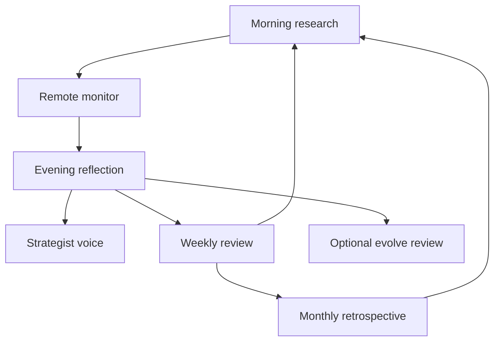

# Prompt Flow

This is the easiest way to understand what each prompt does, when it runs, and how it changes the system over time.

## Sequential View



## 1. Morning Research

File: `scripts/prompts/morning_research.md`

Trigger:
- local pre-market run
- command: `./scripts/run_both.sh morning parallel`

Reads:
- profile metadata
- knowledge files
- recent observations
- yesterday's cache if present
- current positions and snapshots
- web research

Writes:
- `cache/morning_research.json`
- `cache/watchlist.json`
- interaction logs
- then the local runner sanity-checks buy/sell levels against recent prices before commit

Role:
- sets the thesis for the day
- chooses ideas worth watching
- defines natural-language execution conditions

## 2. Monitor Gate

Implementation:
- Python prompt in `ResearchAgent`
- automatic in GitHub Actions

Trigger:
- every 30 minutes during market hours

Reads:
- latest pushed morning files
- live prices
- fresh headlines
- active positions
- strategy signals

Writes:
- runtime reports
- trade decisions
- snapshots and journal updates
- dashboard outputs
- interaction logs for each monitor evaluation

Role:
- thin judgment layer
- not a second morning research pass
- only says whether a live setup still fits the plan
- leaves the dashboard's main morning-thesis stock list intact

## 3. Evening Reflection

File: `scripts/prompts/evening_reflection.md`

Trigger:
- local after close
- command: `./scripts/run_both.sh evening parallel`

Reads:
- today's journal
- current portfolio state and snapshots
- morning thesis
- current knowledge files
- recent daily observations
- web research on the close

Writes:
- daily observation
- knowledge updates
- improvement proposal backlog
- interaction logs

Role:
- turns the day into evidence
- judges plan versus reality
- creates most of the raw learning inputs

## 4. Strategist Voice

File: `scripts/prompts/strategist_voice.md`

Trigger:
- automatically after evening reflection in the same local evening run

Reads:
- latest reflection context
- knowledge files
- proposal backlog
- latest voice if present

Writes:
- `voice/voice_YYYY-MM-DD.json`
- `voice/latest_voice.json`
- interaction logs

Role:
- gives the strategist a short operator-facing voice
- highlights what is weak, improving, noisy, or under-sampled

## 5. Weekly Review

File: `scripts/prompts/weekly_review.md`

Trigger:
- local weekend run
- command: `./scripts/run_both.sh weekly parallel`

Reads:
- recent daily observations
- current knowledge
- weekly performance context

Writes:
- weekly observation
- stronger knowledge updates
- interaction logs

Role:
- filters daily noise
- promotes repeated themes into more durable memory

## 6. Monthly Retrospective

File: `scripts/prompts/monthly_retrospective.md`

Trigger:
- local month-end run
- command: `./scripts/run_both.sh monthly parallel`

Reads:
- weekly reviews
- monthly performance
- current knowledge and proposal backlog

Writes:
- monthly observation
- pruned and reweighted knowledge
- interaction logs

Role:
- cleans up weak assumptions
- keeps the system from accumulating stale lessons forever

## 7. Evolution Review

File: `scripts/prompts/evolution_review.md`

Trigger:
- local on demand
- command: `./scripts/run_both.sh evolve parallel`

Reads:
- `IMPROVEMENT_PROPOSALS.md`
- `improvement_proposals.json`
- latest voice summary
- recent observations
- knowledge files
- portfolio and snapshot history

Writes:
- `evolution_review.json`
- `EVOLUTION_REPORT.md`
- interaction logs

Role:
- not another reflection
- a critical review of which improvements actually deserve implementation

Until this prompt has been run at least once, the dashboard evolution section should show an empty state. That is expected.

## How The Prompts Evolve Over Time

### Day 1

- morning is mostly external research driven
- evening is mostly descriptive
- knowledge is still sparse
- voice will usually say evidence is thin

### After several days

- morning starts seeing recent observations and early lessons
- evening can compare more than one day of behavior
- proposals become less generic

### After a week or two

- weekly review begins shaping regime memory and strategy trust
- voice becomes more grounded because it has a baseline
- evolution becomes more useful because the backlog has actual evidence behind it

### After a month

- monthly review prunes weak rules
- morning prompts stop feeling like blank-slate research
- knowledge becomes genuinely self-earned

## Simple Summary

```text
Morning sets intent.
Monitor checks whether intent still fits live conditions.
Evening records what really happened.
Voice explains current process health.
Weekly and monthly convert repeated evidence into memory.
Evolution decides what changes are actually worth making.
```
